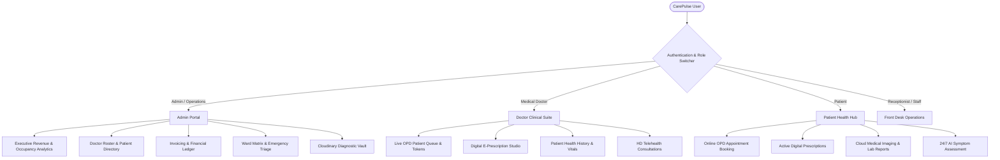

# 🏥 CarePulse HMS — Next-Gen Full-Stack Hospital Management System

[](https://react.dev/)
[](https://vitejs.dev/)
[](https://nodejs.org/)
[](https://expressjs.com/)
[](https://www.mongodb.com/)
[](https://cloudinary.com/)
[](https://opensource.org/licenses/ISC)

> **CarePulse HMS** is an enterprise-grade, full-stack Hospital Management & Clinical Care Ecosystem engineered for modern healthcare institutions. It seamlessly unites **Multi-Role Role-Based Access Control (RBAC)**, **AI-Assisted Diagnostic Scans**, **Real-Time ICU & Ward Bed Matrices**, **Digital E-Prescriptions with Live Vitals**, **HD Telehealth Video Consultations**, **Ambulance GPS Emergency Dispatch**, **Automated Pathology Studios**, and **Itemized Billing & Invoicing** in a responsive, glassmorphic interface.

---

## 📑 Table of Contents

1. [Key Highlights & Architecture](#-key-highlights--architecture)
2. [Multi-Role Portal Breakdown](#-multi-role-portal-breakdown)
3. [Clinical & AI Intelligence Modules](#-clinical--ai-intelligence-modules)
4. [System Architecture & Data Flow](#-system-architecture--data-flow)
5. [Pre-Configured Demo Credentials](#-pre-configured-demo-credentials-1-click-login)
6. [Quick Start & Installation Guide](#-quick-start--installation-guide)
7. [Environment Variables Reference](#-environment-variables-reference)
8. [REST API Specification Reference](#-rest-api-specification-reference)
9. [Project Directory Structure](#-project-directory-structure)
10. [Security & Compliance Standards](#-security--compliance-standards)

---

## 🌟 Key Highlights & Architecture

- **Role-Based Access Control (RBAC)**: Tailored workflows for Chief Admin, Specialist Doctors, Reception / Staff, and Patients.
- **AI-Powered Diagnostics**: Computer vision analyzer for X-Rays, CT Scans, and MRIs with anomaly localization and confidence scores.
- **Live Inpatient Bed & Ward Matrix**: Visual status grid across ICU, Emergency, General Wards, and Deluxe Suites with 1-click admission, discharge, and sanitize toggling.
- **Digital E-Prescription Builder**: Real-time vital metrics capture (BP, Heart Rate, SpO2, Temp, Weight, BMI), multi-drug dosage builder, dietary guidance, and instant print/PDF formatting.
- **Virtual OPD & Telehealth**: High-definition encrypted video consultation rooms with real-time clinical notes and chat.
- **Automated Pathology Report Studio**: Biometric blood chemistry and lab report generation with automated normal range flags.
- **Itemized Billing & Tax Invoicing**: Multi-item ledger covering consultations, procedures, lab tests, room charges, discounts, and printable tax receipts.
- **Ambulance Fleet GPS Tracker**: Real-time emergency vehicle tracking and emergency room triage dispatch.
- **24/7 AI Medical Triage Chatbot**: Natural-language patient symptom assessor and department router.

---

## 🛡️ Multi-Role Portal Breakdown



### 1. 🛡️ Chief Admin & Hospital Operations
- **Executive Real-Time Dashboard**: Total revenue metrics, bed occupancy rates, daily appointments, and OPD queue activity.
- **Hospital Directory**: Comprehensive management of doctors, specialists, medical departments, and registered patients.
- **Ward & Inpatient Manager**: Real-time bed status (Available, Occupied, Maintenance, Sanitizing) with instant admissions and discharge.
- **Financial Billing Engine**: Automated invoice creation with multi-item line breakdown, insurance deductions, tax calculations, and printable invoices.
- **Pharmacy & Stock Inventory**: Real-time inventory tracking for medications, stock alerts, and instant dispenser modal.

### 2. 👨‍⚕️ Specialist Doctor Clinical Suite
- **Today's OPD Queue**: Real-time patient queue with live consultation token management (`#01, #02...`).
- **Digital RX Builder**: Comprehensive prescription generator with patient vitals (BP, Pulse, SpO2, Temp), dosage schedules (Morning/Noon/Night), instructions, and official hospital signature.
- **EMR Health History**: Instant access to patient longitudinal records, past allergies, chronic conditions, and diagnostic scans.
- **Integrated Telehealth**: Launch virtual video consultations directly from the patient consultation modal.

### 3. 👤 Patient Health Hub
- **Self-Service OPD Booking**: Specialty department picker, doctor selection, dynamic time slot calculations, and instant token generation.
- **Digital Prescription Wallet**: View, filter, and print active prescriptions anywhere, anytime.
- **Cloud Medical Records & Vault**: View diagnostic X-Rays, MRI scans, and pathology laboratory results uploaded by hospital staff.
- **AI Symptom Triage**: Interactive medical checker providing preliminary assessment and department recommendations.

---

## 🧠 Clinical & AI Intelligence Modules

| Module | Description | Core Capabilities |
| :--- | :--- | :--- |
| **AI Scan Analyzer** | Multi-organ deep scan analysis | Chest X-Ray pneumonia detection, brain CT anomaly classification, fracture recognition with confidence metrics |
| **Digital E-Prescription** | Standardized medical RX generation | Vitals logging, multi-drug rows, meal timings, printable official hospital RX sheet |
| **Ward & Bed Matrix** | Visual inpatient bed allocator | ICU, Emergency, General Ward, Deluxe Suite occupancy grid with instant admission |
| **Pathology Report Studio** | Automated laboratory generator | Complete blood count (CBC), lipid profile, liver function tests with auto-flagged normal ranges |
| **Telehealth Rooms** | Encrypted virtual consultations | WebRTC-ready HD video rooms with live doctor clinical scratchpad |
| **Ambulance GPS Dispatch** | Emergency vehicle dispatcher | Real-time GPS coordinate simulation, ETA calculation, paramedic communication |

---

## 🔑 Pre-Configured Demo Credentials (1-Click Login)

CarePulse features a **1-Click Instant Demo Launcher** on the landing page and navigation bar. You can also sign in manually with the following accounts:

| Portal Role | Clinical Identity | Email Address | Password |
| :--- | :--- | :--- | :--- |
| **Chief Admin** | Dr. Marcus Vance (Hospital Director) | `admin@carepulse.com` | `Admin@123` |
| **Specialist Doctor** | Dr. Sarah Jenkins (Cardiology Lead) | `sarah.cardio@carepulse.com` | `Doctor@123` |
| **Head Receptionist** | Emma Watson, RN (Front Desk Manager) | `reception@carepulse.com` | `Staff@123` |
| **Registered Patient** | Alex Johnson (Blood Group O+) | `alex.johnson@example.com` | `Patient@123` |

---

## 🚀 Quick Start & Installation Guide

### Prerequisites
- **Node.js**: v18.0.0 or higher
- **MongoDB**: Local instance running on port `27017` or a MongoDB Atlas connection string
- **NPM** or **Yarn**

---

### Step 1: Setup Backend Server

```bash
# Navigate to backend directory
cd BACKEND

# Install dependencies
npm install

# Start the server (includes automatic database seeding on first connection)
npm start
```

- Backend server starts at **`http://localhost:5000`**
- Health check endpoint: `http://localhost:5000/api/health`
- *Note: On first startup, the database seeder automatically creates test doctors, patients, wards, beds, appointments, and prescriptions.*

---

### Step 2: Setup Frontend Web App

```bash
# Navigate to frontend directory
cd FRONTEND

# Install dependencies
npm install

# Start the Vite development server
npm run dev
```

- Open your browser at **`http://localhost:5173`** (or the port specified in your terminal).

---

## ⚙️ Environment Variables Reference

### Backend (`BACKEND/.env`)
```env
# Server Configuration
PORT=5000
NODE_ENV=development

# MongoDB Database Connection
MONGO_URI=mongodb://localhost:27017/carepulse_hms

# JWT Authentication Secret
JWT_SECRET=carepulse_super_secret_jwt_key_2026
JWT_EXPIRE=30d

# Cloudinary Storage (Optional: defaults to high-speed data URI buffer if empty)
CLOUDINARY_CLOUD_NAME=your_cloud_name
CLOUDINARY_API_KEY=your_api_key
CLOUDINARY_API_SECRET=your_api_secret
```

---

## 📡 REST API Specification Reference

All endpoints are prefixed with `/api`. Protected routes require a Bearer token in the `Authorization` header (`Bearer <token>`).

### 1. Authentication (`/api/auth`)
| Method | Endpoint | Access | Description |
| :--- | :--- | :--- | :--- |
| `POST` | `/api/auth/register` | Public | Register a new patient account |
| `POST` | `/api/auth/login` | Public | Authenticate user & return JWT token |
| `GET` | `/api/auth/me` | Private | Get authenticated user profile |
| `PUT` | `/api/auth/profile` | Private | Update user profile details |

### 2. Doctors & Specialists (`/api/doctors`)
| Method | Endpoint | Access | Description |
| :--- | :--- | :--- | :--- |
| `GET` | `/api/doctors` | Public | Retrieve all active doctors with specialties |
| `GET` | `/api/doctors/:id` | Public | Get single doctor details, fee, and available slots |
| `POST` | `/api/doctors` | Admin | Create a new doctor profile |
| `PUT` | `/api/doctors/:id` | Admin/Doctor | Update doctor information or schedule |
| `DELETE` | `/api/doctors/:id` | Admin | Deactivate a doctor profile |

### 3. Patients (`/api/patients`)
| Method | Endpoint | Access | Description |
| :--- | :--- | :--- | :--- |
| `GET` | `/api/patients` | Staff/Doctor | List all registered patients with pagination |
| `GET` | `/api/patients/:id` | Private | Get patient EMR records & medical files |
| `POST` | `/api/patients` | Staff/Admin | Register patient directly from front desk |
| `PUT` | `/api/patients/:id` | Staff/Admin | Update patient medical record |

### 4. Appointments & OPD Queue (`/api/appointments`)
| Method | Endpoint | Access | Description |
| :--- | :--- | :--- | :--- |
| `GET` | `/api/appointments` | Private | List appointments (filtered by role/doctor/patient) |
| `POST` | `/api/appointments` | Private | Book new appointment & generate queue token |
| `GET` | `/api/appointments/:id` | Private | Get specific appointment details |
| `PUT` | `/api/appointments/:id/status` | Doctor/Staff | Update status (`Scheduled`, `In-Consultation`, `Completed`, `Cancelled`) |

### 5. Prescriptions (`/api/prescriptions`)
| Method | Endpoint | Access | Description |
| :--- | :--- | :--- | :--- |
| `GET` | `/api/prescriptions` | Private | List prescriptions for current doctor/patient |
| `POST` | `/api/prescriptions` | Doctor | Create digital prescription with vitals & medicines |
| `GET` | `/api/prescriptions/:id` | Private | Retrieve full printable RX document |

### 6. Inpatient Ward & Bed Matrix (`/api/beds`)
| Method | Endpoint | Access | Description |
| :--- | :--- | :--- | :--- |
| `GET` | `/api/beds` | Private | Retrieve all beds across ICU, Emergency, General wards |
| `POST` | `/api/beds/admit` | Staff/Admin | Admit patient to specific bed |
| `POST` | `/api/beds/discharge` | Staff/Admin | Discharge patient and set bed to sanitizing |
| `PUT` | `/api/beds/:id/status` | Staff/Admin | Update bed status (`Available`, `Occupied`, `Maintenance`) |

### 7. Billing & Invoices (`/api/billing`)
| Method | Endpoint | Access | Description |
| :--- | :--- | :--- | :--- |
| `GET` | `/api/billing` | Private | Retrieve invoice history & financial stats |
| `POST` | `/api/billing` | Staff/Admin | Create itemized invoice with taxes & discounts |
| `GET` | `/api/billing/:id` | Private | Fetch printable invoice sheet |
| `PUT` | `/api/billing/:id/pay` | Staff/Admin | Mark invoice as paid (`Cash`, `Card`, `Insurance`) |

### 8. Diagnostic Upload Vault & Scans (`/api/upload`)
| Method | Endpoint | Access | Description |
| :--- | :--- | :--- | :--- |
| `POST` | `/api/upload` | Staff/Doctor | Upload scan / PDF document to Cloudinary vault |
| `GET` | `/api/upload/patient/:id` | Private | List all diagnostic files for a patient |

### 9. AI Diagnostics & Triage (`/api/ai` & `/api/chatbot`)
| Method | Endpoint | Access | Description |
| :--- | :--- | :--- | :--- |
| `POST` | `/api/ai/analyze-scan` | Private | Execute AI computer vision analysis on scan |
| `POST` | `/api/chatbot/message` | Public | Send message to 24/7 AI Medical Assistant |

---

## 📂 Project Directory Structure

```
HMS/
├── BACKEND/
│   ├── config/             # Database (db.js) & Cloudinary configuration
│   ├── controllers/        # Express request handlers for all 11 modules
│   ├── middlewares/        # JWT auth, error handlers, and file upload
│   ├── models/             # Mongoose schemas (User, Patient, Doctor, Appointment, etc.)
│   ├── routes/             # REST API endpoint definitions
│   ├── seeders/            # Automated database seed fixtures
│   ├── server.js           # Express application entrypoint
│   └── package.json
│
├── FRONTEND/
│   ├── public/             # Static assets, SVG icons, and hero images
│   ├── src/
│   │   ├── assets/         # App graphics and branding
│   │   ├── components/
│   │   │   ├── common/     # Sidebar, Navbar, RoleSwitcher, ChatBot, StatCard, etc.
│   │   │   ├── emergency/  # AmbulanceTrackerModal
│   │   │   ├── lab/        # PathologyReportGeneratorModal
│   │   │   ├── pharmacy/   # PharmacyDispenserModal, PharmacyInventoryModal
│   │   │   ├── scans/      # AiScanAnalyzerModal
│   │   │   ├── telehealth/ # TelehealthRoomModal
│   │   │   └── triage/     # SymptomTriageModal
│   │   ├── context/        # AuthContext (RBAC) & ToastContext
│   │   ├── pages/
│   │   │   ├── admin/      # AdminPortal (Executive suite)
│   │   │   ├── doctor/     # DoctorPortal (Clinical OPD & E-Prescriptions)
│   │   │   ├── patient/    # PatientPortal (Health Hub & Self-Service)
│   │   │   ├── LandingPage.jsx  # Modern Hospital Landing Page
│   │   │   ├── Login.jsx        # Dedicated Sign-In Page
│   │   │   └── Register.jsx     # Patient Registration Page
│   │   ├── services/       # Centralized Axios API service layer
│   │   ├── styles/         # Modern CSS design system (index.css, components.css)
│   │   ├── App.jsx         # App router and layout orchestrator
│   │   └── main.jsx        # React root mount point
│   ├── package.json
│   └── vite.config.js
└── README.md
```

---

## 🔒 Security & Compliance Standards

- **Password Hashing**: Industry standard `bcryptjs` salted password hashing.
- **Stateless Tokens**: JWT (JSON Web Tokens) with configurable expiration and secure HTTP header validation.
- **Data Privacy**: Granular role-based endpoints ensuring patients only access their own clinical data.
- **HIPAA-Ready Architecture**: Audit-ready timestamps and role separation for doctor prescriptions and laboratory records.
- **Cloud Vault Encryption**: Media assets securely stored with Cloudinary TLS encryption.

---

## 📄 License & Attribution

CarePulse Hospital Management System is released under the **ISC License**. Developed with modern React 19, Vite, Express, and MongoDB.
